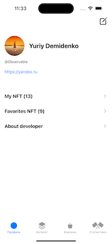
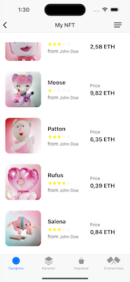
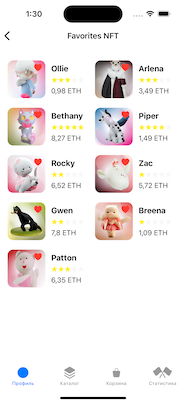
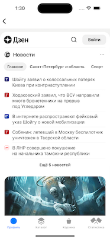

# FakeNFT

Приложение помогает пользователям просматривать и покупать NFT (Non-Fungible Token). По сути имитация маркетплейса, специализирующегося на NFT. Функционал покупки иммитируется с помощью мокового сервера [mockapi.io](https://mockapi.io). При разработке приложения отрабатывались навыки работы в команде. Моя зона ответственности - экран профиля. Моковый API имеет ограничение 30 запросов в минуту. Поэтому, при работе приложения возможно получить ошибку от сервера с кодом 429 (Too Many Requests), в этом случае надо немного подождать. 

   

## Применённые технологии

- **Архитектура:** MVVM (без combine и React-фреймворков), SOLID, DRY, YAGNI, KISS, Object Oriented Programming (ООП), Protocol-Oriented Programming (POP), работа с делегатами и замыканиями, extensions, propertyWrapper, паттерн Key-value observing (KVO), NotificationCenter, хранилище UserDefaults

- **Работа в команде:** декомпозирование задач, работа в таск-трекере, Trello, GitHub, pachca, Telegram

- **UI и вёрстка:** UIKit, вёрстка кодом с AutoLayout, UITableView, UIScrollView, UICollectionView, UIStackView, анимации UIView.animate, реализация локализации и тёмной темы, Human Interface Guidelines (HIG)

- **Навигация:** UITabBarController, UINavigationController

- **Работа с сетью:** запросы HTTP и REST API, URLSession, URLRequest, JSONDecoder, Codable, DispatchGroup, WKWebView, URL validation

- **Многопоточность:** предотвращение race condition, DispatchQueue, блокировка UI

- **Тестирование:** UI-тесты и Unit-тесты (XCTest), Charles Proxy (сетевые запросы)

- **Зависимости:** Swift Package Manager (SPM), Kingfisher, ProgressHUD

- **Система контроля версий:** git (из командной строки), GitHub, Sourcetree, решение конфликтов в git

# ТЗ мобильного приложения

# Ссылки

[Дизайн Figma](https://www.figma.com/file/k1LcgXHGTHIeiCv4XuPbND/FakeNFT-(YP)?node-id=96-5542&t=YdNbOI8EcqdYmDeg-0)

# Цели приложения

- просмотр коллекций NFT;
- просмотр и покупка NFT (иммитируется);
- просмотр рейтинга пользователей.

# Краткое описание приложения

- Приложение демонстрирует каталог NFT, структурированных в виде коллекций
- Пользователь может посмотреть информацию о каталоге коллекций, выбранной коллекции и выбранном NFT.
- Пользователь может добавлять понравившиеся NFT в избранное.
- Пользователь может удалять и добавлять товары в корзину, а также оплачивать заказ (покупка иммитируется).
- Пользователь может посмотреть рейтинг пользователей и информацию о пользователях.
- Пользователь может смотреть информацию и своем профиле, включая информацию об избранных и принадлежащих ему NFT.

Дополнительным (необязательным) функционалом являются:
- локализация
- тёмная тема
- статистика на основе Яндекс Метрики
- экран авторизации
- экран онбординга
- алерт с предложением оценить приложение
- сообщение о сетевых ошибках
- кастомный launch screen
- поиск по таблице/коллекции в своём эпике

# Функциональные требования

## Каталог

**Экран каталога**

На экране каталога отображается таблица (UITableView), показывающая доступные коллекции NFT. Для каждой коллекции NFT отображается:
- изображение коллекции;
- название коллекции;
- количество NFT в коллекции.

Также на экране есть кнопка сортировки, при нажатии на которую пользователю предлагается выбрать один из доступных способов сортировки. Содержимое таблицы упорядочивается согласно выбранному способу.

Пока данные для показа не загружены, должен отображаться индикатор загрузки.

При нажатии на одну из ячеек таблицы пользователь попадает на экран выбранной коллекции NFT.

**Экран коллекции NFT**

Экран отображает информацию о выбранной коллекции NFT, и содержит:

- изображение коллекции NFT;
- название коллекции NFT;
- текстовое описание коллекции NFT;
- имя автора коллекции (ссылка на его сайт);
- коллекцию (UICollectionView) с информацией о входящий в коллекцию NFT.

При нажатии на имя автора коллекции открывается его сайт в вебвью.

Каждая ячейка коллекции содержит:
- изображение NFT;
- название NFT;
- рейтинг NFT;
- стоимость NFT (в ETH);
- кнопку для добавления в избранное / удаления из избранного (сердечко);
- кнопку добавления NFT в корзину / удаления NFT из корзины.

При нажатии на сердечко производится добавление NFT в избранное / удаление NFT из избранного.

При нажатии на кнопку добавления NFT в корзину / удаления NFT из корзины производится добавление или удаление NFT из заказа (корзины). 

При нажатии на ячейку открывается экран NFT.

**Экран NFT**

Экран частично реализуется наставником в ходе life coding. Реализация экрана студентами не требуется.

## Корзина

**Экран заказа**

На экране таблицы отображается таблица (UITableView) со списком добавленных в заказ NFT.
Для каждого NFT указаны:
- изображение;
- имя;
- рейтинг;
- цена;
- кнопка удаления из корзины.

При нажатии на кнопку удаления из корзины показывается экран подтверждения удаления, который содержит:
- изображение NFT;
- кнопку подтверждения удаления;
- кнопку отказа от удаления.

Сверху на экране есть кнопка сортировки, при нажатии на которую пользователю предлагается выбрать один из доступных способов сортировки. Содержимое таблицы упорядочивается согласно выбранному способу.

Внизу экрана расположена панель с количеством NFT в заказе, общей ценой и кнопкой оплатить.
При нажатии на кнопку оплаты происходит переход на экран выбора валюты.

Пока данные для показа не загружены, должен отображаться индикатор загрузки.

**Экран выбора валюты**

Экран позволяет выбрать валюту для оплаты заказа.

Сверху экрана находится заголовок и кнопка возврата на предыдущий экран.
Под ним - коллекция UICollectionCell с доступными способами оплаты.
Для каждой валюты указывается:
- логотип;
- полное наименование;
- сокращенное наименование.

Внизу находится текст со ссылкой на пользовательское соглашение (ведет на https://yandex.ru/legal/practicum_termsofuse/ , открывается в вебвью).

Под текстом - кнопка оплаты, при ее нажатии посылается запрос на сервер. Если сервер ответил, что оплата прошла успешно, то показывается экран с информацией об этом и кнопкой возврата в корзину. В случае неуспешной оплаты показывается соответствующий экран с кнопками повтора запроса и возврата в корзину.

## Профиль

**Экран профиля**

Экран показывает информацию о пользователе. Он содержит:
- фото пользователя;
- имя пользователя;
- описание пользователя;
- таблицу (UITableView) с ячейками Мои NFT (ведет на экран NFT пользователя), Избранные NFT (ведет на экран с избранными NFT), Сайт пользователя (открывает в вебвью сайт пользователя).
представляет собой  

**Экран Мои NFT**

Представляет собой таблицу (UITableView), каждая ячейка которой содержит:
- иконку NFT;
- название NFT;
- автора NFT;
- цену NFT в ETH.

Сверху на экране есть кнопка сортировки, при нажатии на которую пользователю предлагается выбрать один из доступных способов сортировки. Содержимое таблицы упорядочивается согласно выбранному способу.

В случае отсутствия NFT показывается соответствующая надпись.

**Экран Избранные NFT**

Содержит коллекцию (UICollectionView) c NFT, добавленными в избранное (лайкнутыми). Каждая ячейка содержит информацию об NFT:
- иконка;
- название;
- рейтинг;
- цена в ETH.

В случае отсутствия избранных NFT показывается соответствующая надпись.

## Статистика

**Экран рейтинга**

Экран отображает список пользователей. Он представляет собой таблицу (UITableView). Для каждого пользователя указываются:
- место в рейтинге;
- аватарка;
- имя пользователя;
- количество NFT.

Сверху на экране есть кнопка сортировки, при нажатии на которую пользователю предлагается выбрать один из доступных способов сортировки. Содержимое таблицы упорядочивается согласно выбранному способу.

При нажатии на одну из ячеек происходит переход на экран информации о пользователе.

**Экран информации о пользователе**

Экран отображает информацию о пользователе:

- фото пользователя;
- имя пользователя;
- описание пользователя.

Также он содержит кнопку перехода на сайт пользователя (открывается в вебвью) и возможность перехода на экран Коллекции пользователя.

**Экран коллекции пользователя**

Содержит коллекцию (UICollectionView) c NFT пользователя. Каждая ячейка содержит информацию об NFT:
- иконка;
- название;
- рейтинг.
